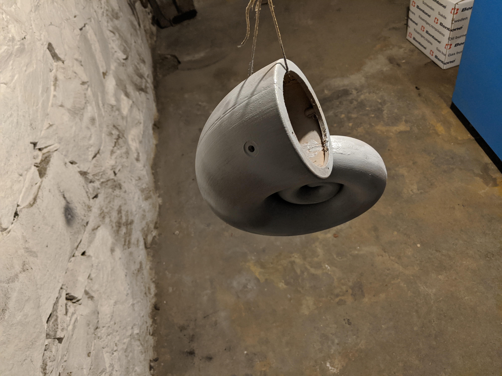
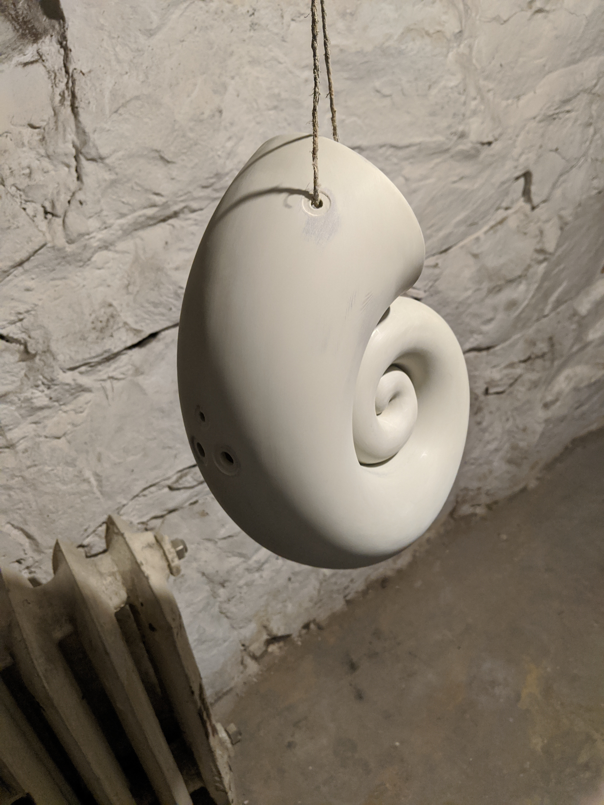

I first found these speakers in [this Youtube-video](https://www.youtube.com/watch?v=h-RSm97lkOU), and thought that this would be a nice project for experimenting with wood PLA.

There seems to be many different approaches to printing these, based on the size of the printing bed that you have available.
My printer can has a 300x300mm bed, so printing the speakers in two halfs was possible.
Thingiverse has STLs where the speakers have been cut into more than two parts, allowing printing on smaller beds.

I do not remember where I got a hold of [the STLs that I used](./files/akemake_spirula_4inch.zip).

## Printing the speakers

I used [Filamentive wood PLA filament](https://no.farnell.com/filamentive/10917/3d-printer-filament-wood-1-75mm/dp/2917113) with my Creality CR-10S Pro printer.
Total print time was around 20 hours per half speaker. The STLs was sliced with Cura (find out infill etc).

## Assembling the speaker halfs

I decided on epoxy to glue the speaker halfs together. Time will tell if this holds up.

As usual the printed parts had a lot of visible lines and grooves. I was hoping that sanding, spackling paste, and spray plaster would provide a nicer finish.

The epoxy had a cure time of 24 hours. This provided ample time to adjust the parts while clamping.
People also claimed that the longer curing time would produce a stronger joint, but I have no idea if that is true.

## Preparing the surface of the parts

The surface was first sanded with a palm sander and some coarse sanding paper.

I then primed the speakers so the spackling paste would adhere better to the parts.

The seam and other large pits was the spackled.

Several layers of spray plaster was then sprayed on.
I've seen other people wanting to showcase the pattern on the sides of the speakers, but I wanted a completely smooth surface.

## Things left to do

- Finish surface treatment
- Paint
- Stuff
- Wire
- Mount speaker terminals
- Mount speakers
- Make feet
- Mount feet
